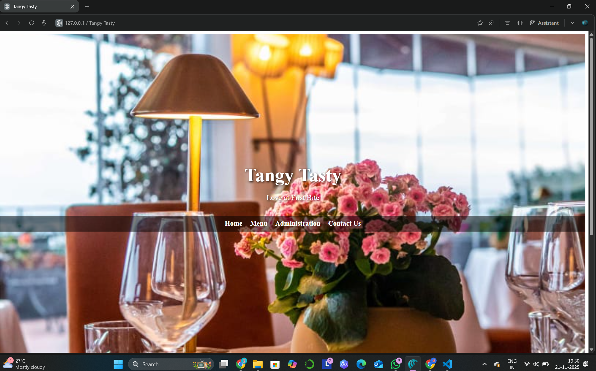
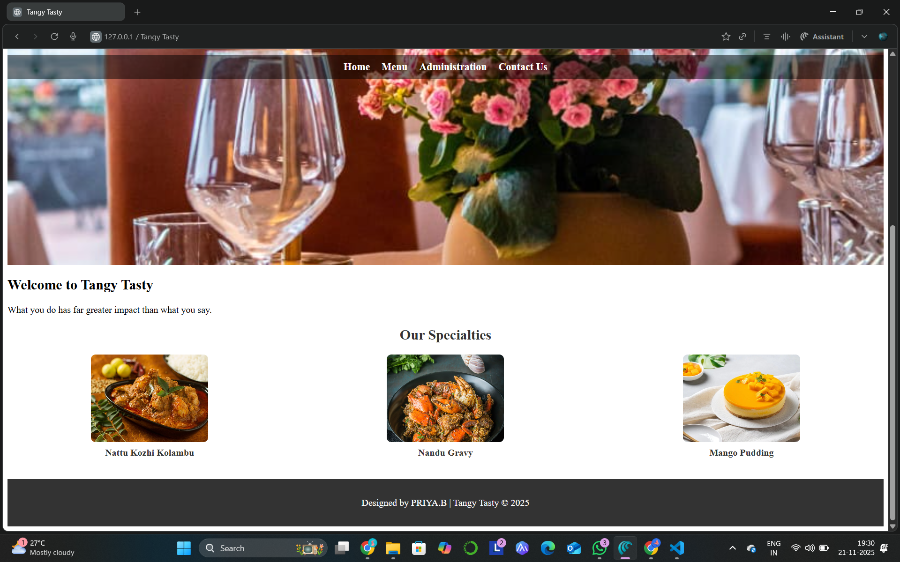
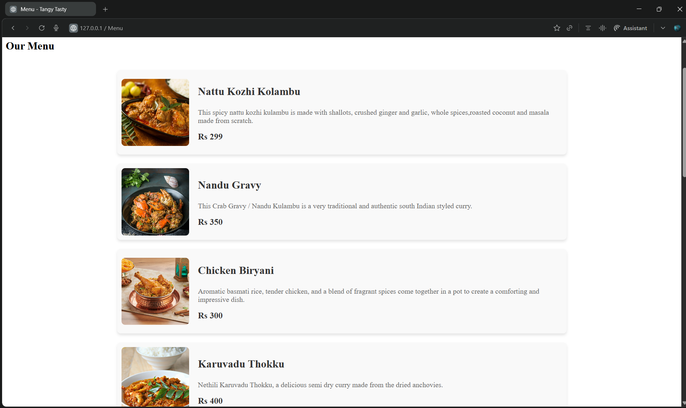
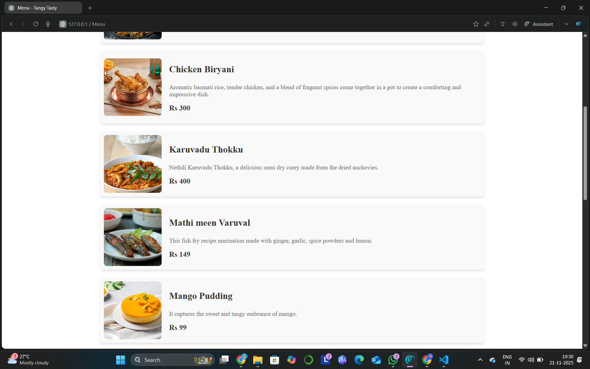
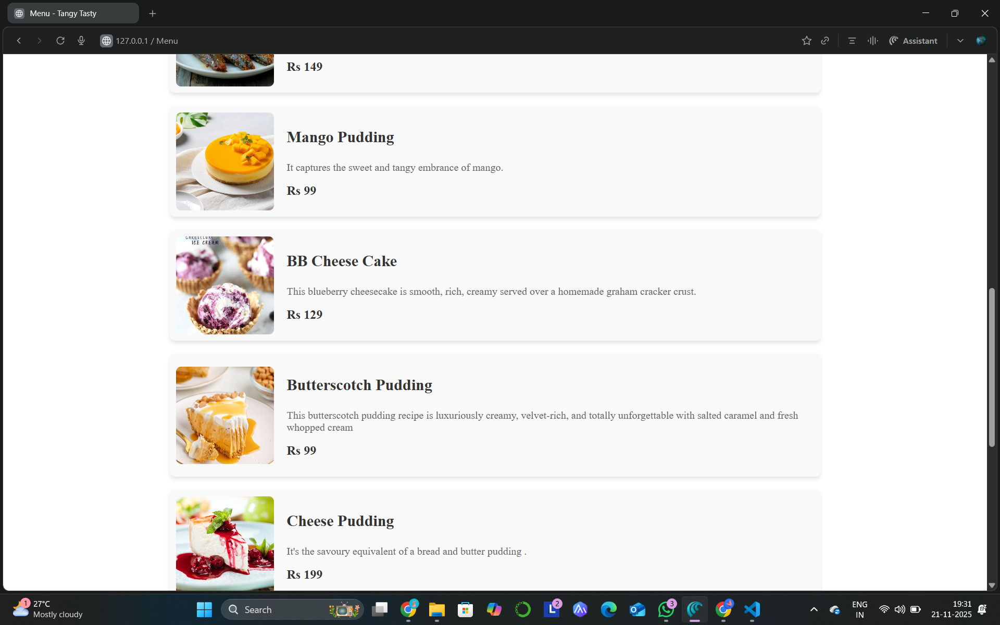
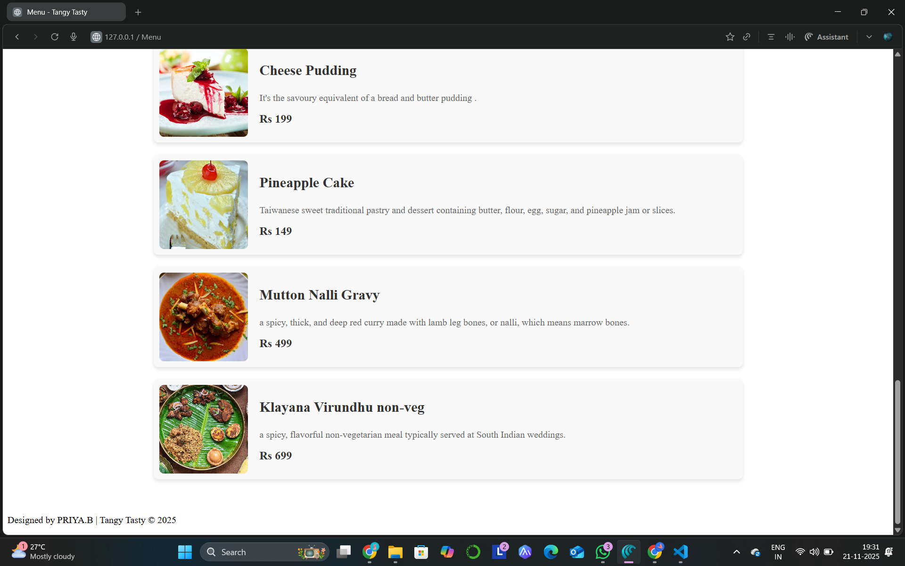
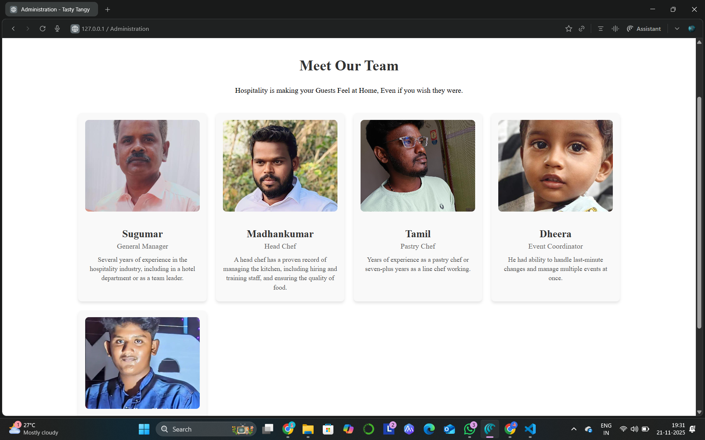
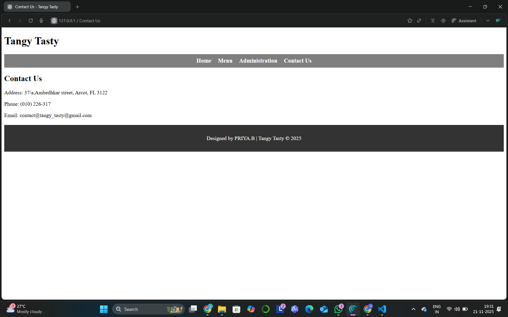

# Ex.07 Restuarant Website
## Date: 21.11.25

## AIM:
To develop a static Resturant website to display the menu and services provided by the resturant.

## DESIGN STEPS:

### Step 1:
Requirement collection.

### Step 2:
Creating the layout using HTML and CSS.

### Step 3:
Updating the sample content.

### Step 4:
Choose the appropriate style and color scheme.

### Step 5:
Validate the layout in various browsers.

### Step 6:
Validate the HTML code.

### Step 7:
Publish the website in the given URL.

## PROGRAM:
### index.html
```
<!DOCTYPE html>
<html lang="en">
<head>
    <meta charset="UTF-8">
    <meta name="viewport" content="width=device-width, initial-scale=1.0">
    <title>Tangy Tasty</title>
    <link rel="stylesheet" href="styles.css">
</head>
<body>
    <header class="home-header">
        <div class="banner">
            <h1>Tangy Tasty</h1>
            <p>Love at First Bite</p>
        </div>
        <nav>
            <ul>
                <li><a href="index.html">Home</a></li>
                <li><a href="menu.html">Menu</a></li>
                <li><a href="administration.html">Administration</a></li>
                <li><a href="contact.html">Contact Us</a></li>
            </ul>
        </nav>
    </header>
    <main>
        <section class="welcome">
            <h2>Welcome to Tangy Tasty</h2>
            <p>What you do has far greater impact than what you say.</p>
        </section>
        <section class="featured">
            <h2>Our Specialties</h2>
            <div class="featured-items">
                <div class="featured-item">
                    
                    <p>Nattu Kozhi Kolambu</p>
                </div>
                <div class="featured-item">
                    
                    <p>Nandu Gravy</p>
                </div>
                <div class="featured-item">
                    
                    <p>Mango Pudding</p>
                </div>
            </div>
        </section>
    </main>
    <footer>
        <p>Designed by B.PRIYA | Tangy Tasty © 2025</p>
    </footer>
</body>
</html>
```
### menu.html
```
<!DOCTYPE html>
<html lang="en">
<head>
    <meta charset="UTF-8">
    <meta name="viewport" content="width=device-width, initial-scale=1.0">
    <title>Menu - Tangy Tasty</title>
    <link rel="stylesheet" href="styless.css">
</head>
<body>
    <header>
        <div class="banner">
            <h1>Tangy Tasty</h1>
        </div>
        <nav>
            <ul>
                <li><a href="index.html">Home</a></li>
                <li><a href="menu.html">Menu</a></li>
                <li><a href="administration.html">Administration</a></li>
                <li><a href="contact.html">Contact Us</a></li>
            </ul>
        </nav>
    </header>
    <main>
        <h2>Our Menu</h2>
        <div class="menu-card">
            <div class="menu-item">
                
                <div class="menu-details">
                    <h3>Nattu Kozhi Kolambu</h3>
                    <p>This spicy nattu kozhi kulambu is made with shallots, crushed ginger and garlic, whole spices,roasted coconut and masala made from scratch.</p>
                    <p class="price">Rs 299</p>
                </div>
            </div>
            <div class="menu-item">
                
                <div class="menu-details">
                    <h3>Nandu Gravy</h3>
                    <p>This Crab Gravy / Nandu Kulambu is a very traditional and authentic south Indian styled curry.</p>
                    <p class="price">Rs 350</p>
                </div>
            </div>
            <div class="menu-item">
                
                <div class="menu-details">
                    <h3>Chicken Biryani</h3>
                    <p>Aromatic basmati rice, tender chicken, and a blend of fragrant spices come together in a pot to create a comforting and impressive dish.</p>
                    <p class="price">Rs 300</p>
                </div>
            </div>
            <div class="menu-item">
                
                <div class="menu-details">
                    <h3>Karuvadu Thokku</h3>
                    <p>Nethili Karuvadu Thokku, a delicious semi dry curry made from the dried anchovies.</p>
                    <p class="price">Rs 400</p>
                </div>
            </div>
            <div class="menu-item">
                
                <div class="menu-details">
                    <h3>Mathi meen Varuval</h3>
                    <p>This fish fry recipe marination made with ginger, garlic, spice powders and lemon.</p>
                    <p class="price">Rs 149</p>
                </div>
            </div>
            <div class="menu-item">
                
                <div class="menu-details">
                    <h3>Mango Pudding</h3>
                    <p>It captures the sweet and tangy embrance of mango.</p>
                    <p class="price">Rs 99</p>
                </div>
            </div>
            <div class="menu-item">
                
                <div class="menu-details">
                    <h3>BB Cheese Cake</h3>
                    <p>This blueberry cheesecake is smooth, rich, creamy served over a homemade graham cracker crust.</p>
                    <p class="price">Rs 129</p>
                </div>
            </div>
            <div class="menu-item">
                
                <div class="menu-details">
                    <h3>Butterscotch Pudding</h3>
                    <p>This butterscotch pudding recipe is luxuriously creamy, velvet-rich, and totally unforgettable with salted caramel and fresh whopped cream</p>
                    <p class="price">Rs 99</p>
                </div>
            </div>
            <div class="menu-item">
                
                <div class="menu-details">
                    <h3>Cheese Pudding</h3>
                    <p>It's the savoury equivalent of a bread and butter pudding .</p>
                    <p class="price">Rs 199</p>
                </div>
            </div>
            <div class="menu-item">
                
                <div class="menu-details">
                    <h3>Pineapple Cake</h3>
                    <p> Taiwanese sweet traditional pastry and dessert containing butter, flour, egg, sugar, and pineapple jam or slices.</p>
                    <p class="price">Rs 149</p>
                </div>
            </div>
            <div class="menu-item">
                
                <div class="menu-details">
                    <h3>Mutton Nalli Gravy</h3>
                    <p>a spicy, thick, and deep red curry made with lamb leg bones, or nalli, which means marrow bones.</p>
                    <p class="price">Rs 499</p>
                </div>
            </div>
            <div class="menu-item">
                
                <div class="menu-details">
                    <h3>Klayana Virundhu non-veg</h3>
                    <p>a spicy, flavorful non-vegetarian meal typically served at South Indian weddings.</p>
                    <p class="price">Rs 699</p>
                </div>
            </div>
    </main>
    <footer>
        <p>Designed by PRIYA.B | Tangy Tasty © 2025</p>
    </footer>
</body>
</html>
```
### administration.html
```
<!DOCTYPE html>
<html lang="en">
<head>
    <meta charset="UTF-8">
    <meta name="viewport" content="width=device-width, initial-scale=1.0">
    <title>Administration - Tasty Tangy</title>
    <link rel="stylesheet" href="sty.css">
</head>
<body>
    <header>
        <div class="banner">
            <h1>Tangy Tasty</h1>
        </div>
        <nav>
            <ul>
                <li><a href="index.html">Home</a></li>
                <li><a href="menu.html">Menu</a></li>
                <li><a href="administration.html">Administration</a></li>
                <li><a href="contact.html">Contact Us</a></li>
            </ul>
        </nav>
    </header>
    <main>
        <div class="admin-container">
            <div class="admin-header">
                <h2>Meet Our Team</h2>
                <p>Hospitality is making your Guests Feel at Home, Even if you wish they were.</p>
            </div>
            <div class="admin-grid">
                <!-- Team Member 1 -->
                <div class="admin-card">
                    
                    <h3>Sugumar</h3>
                    <p>General Manager</p>
                    <p class="experience">Several years of experience in the hospitality industry, including in a hotel department or as a team leader.</p>
                </div>
                <!-- Team Member 2 -->
                <div class="admin-card">
                    
                    <h3>Madhankumar</h3>
                    <p>Head Chef</p>
                    <p class="experience">A head chef has a proven record of managing the kitchen, including hiring and training staff, and ensuring the quality of food.</p>
                </div>
                <!-- Team Member 3 -->
                <div class="admin-card">
                    
                    <h3>Tamil</h3>
                    <p>Pastry Chef</p>
                    <p class="experience">Years of experience as a pastry chef or seven-plus years as a line chef working.</p>
                </div>
                <!-- Team Member 4 -->
                <div class="admin-card">
                    
                    <h3>Dheera</h3>
                    <p>Event Coordinator</p>
                    <p class="experience">He had ability to handle last-minute changes and manage multiple events at once.</p>
                </div>
                <!-- Team Member 4 -->
                <div class="admin-card">
                    
                    <h3>Sri</h3>
                    <p>Master Chef</p>
                    <p class="experience">He have years of experience in both cooking and in a leadership role.</p>
                </div>
            </div>
        </div>
    </main>
    <footer>
        <p>Designed by PRIYA.B | Tangy Tasty © 2024</p>
    </footer>
</body>
</html>
```
### contact.html
```
<!DOCTYPE html>
<html lang="en">
<head>
    <meta charset="UTF-8">
    <meta name="viewport" content="width=device-width, initial-scale=1.0">
    <title>Contact Us - Tangy Tasty</title>
    <link rel="stylesheet" href="styles.css">
</head>
<body>
    <header>
        <div class="banner">
            <h1>Tangy Tasty</h1>
        </div>
        <nav>
            <ul>
                <li><a href="index.html">Home</a></li>
                <li><a href="menu.html">Menu</a></li>
                <li><a href="administration.html">Administration</a></li>
                <li><a href="contact.html">Contact Us</a></li>
            </ul>
        </nav>
    </header>
    <main>
        <h2>Contact Us</h2>
        <p>Address: 37/a,Ambedhkar street, Arcot, FL 3122</p>
        <p>Phone: (010) 226-317</p>
        <p>Email: contact@tangy_tasty@gmail.com</p>
    </main>
    <footer>
        <p>Designed by PRIYA.B | Tangy Tasty © 2025</p>
    </footer>
</body>
</html>
``` 
### sty.css
```
/* Administration Page */
.admin-container {
    max-width: 1200px;
    margin: 20px auto;
    padding: 20px;
}

.admin-header {
    text-align: center;
    margin-bottom: 30px;
}

.admin-header h2 {
    font-size: 2em;
    color: #333;
}

.admin-grid {
    display: grid;
    grid-template-columns: repeat(auto-fit, minmax(250px, 1fr)); /* Responsive columns */
    gap: 20px;
    padding: 10px;
}

.admin-card {
    text-align: center;
    background: #f9f9f9;
    border-radius: 8px;
    box-shadow: 0 4px 6px rgba(0, 0, 0, 0.1);
    padding: 15px;
    transition: transform 0.2s;
}

.admin-card:hover {
    transform: scale(1.05); /* Subtle zoom on hover */
}

.admin-card img {
    width: 100%;
    height: 200px;
    object-fit: cover; /* Ensures consistent image size */
    border-radius: 8px;
    margin-bottom: 10px;
}

.admin-card h3 {
    font-size: 1.4em;
    color: #333;
    margin-bottom: 5px;
}

.admin-card p {
    font-size: 1em;
    color: #666;
    margin: 5px 0;
}

.admin-card .experience {
    font-size: 0.9em;
    color: #555;
    margin-top: 10px;
    line-height: 1.4;
}

/* Footer */
footer {
    text-align: center;
    padding: 15px;
    background: #333;
    color: white;
    margin-top: 20px;
}
```
### styles.css
```
/* Background Image for Home Page */
.home-header {
    background: url('bg.jpg') no-repeat center center/cover;
    height: 100vh; /* Full screen height */
    color: white;
    display: flex;
    flex-direction: column;
    justify-content: center;
    text-align: center;
}

.home-header .banner h1 {
    font-size: 3em;
    margin-bottom: 10px;
    text-shadow: 2px 2px 5px rgba(0, 0, 0, 0.7);
}

.home-header .banner p {
    font-size: 1.2em;
    text-shadow: 2px 2px 5px rgba(0, 0, 0, 0.7);
}

/* Navigation Styles */
nav ul {
    display: flex;
    justify-content: center;
    gap: 20px;
    padding: 10px;
    background: rgba(0, 0, 0, 0.5);
    list-style: none;
}

nav ul li a {
    color: white;
    text-decoration: none;
    font-weight: bold;
    font-size: 1.1em;
}

nav ul li a:hover {
    text-decoration: underline;
}

/* Featured Section */
.featured {
    margin: 20px 0;
    text-align: center;
    color: #333;
}

.featured-items {
    display: flex;
    justify-content: space-around;
    gap: 20px;
}

.featured-item img {
    width: 200px;
    height: 150px;
    object-fit: cover;
    border-radius: 8px;
}

.featured-item p {
    text-align: center;
    margin-top: 5px;
    font-weight: bold;
}
/* Footer */
footer {
    text-align: center;
    padding: 15px;
    background: #333;
    color: white;
    margin-top: 20px;
}
```
### styless.css
```
/* Menu Card Layout */
.menu-card {
    max-width: 1000px;
    margin: 20px auto;
    padding: 20px;
}

.menu-item {
    display: flex;
    align-items: center;
    gap: 20px;
    margin-bottom: 20px;
    padding: 10px;
    background: #f9f9f9;
    border-radius: 8px;
    box-shadow: 0 4px 6px rgba(0, 0, 0, 0.1);
}

.menu-item img {
    width: 150px;
    height: 150px;
    object-fit: cover;
    border-radius: 8px;
}

.menu-details {
    flex: 1;
}

.menu-details h3 {
    font-size: 1.5em;
    color: #333;
}

.menu-details p {
    color: #666;
    margin-top: 5px;
}

.menu-details .price {
    color: #333;
    font-size: 1.2em;
    font-weight: bold;
    margin-top: 10px;
}
```
## OUTPUT:









## RESULT:
The program for designing software company website using HTML and CSS is completed successfully.
